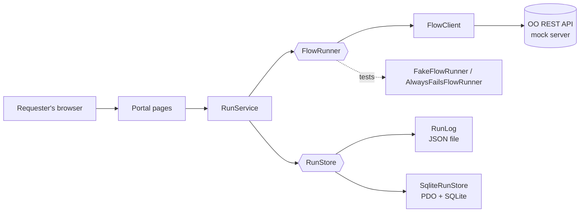

# OO Portal

A self-service portal for requesting and tracking orchestrated automations, built in object-oriented PHP 8 against a REST API modeled on Micro Focus / OpenText Operations Orchestration (OO) Central.

Teams pick an approved automation, enter validated inputs, and start it with one click. The portal starts the flow through the OO REST API, records who requested it and when, and shows live status until the run finishes. In orchestration terms, it's an **invocation channel**: a standardized, traceable way for teams to order automation without logging into OO Central.

> This is a practice and portfolio project. It runs against an included mock OO server, so no real OO instance or credentials are needed.

## What it demonstrates

- **Object-oriented PHP 8:** classes, interfaces, readonly value objects, constructor property promotion, named arguments, `match` expressions, and custom exceptions
- **Interfaces and polymorphism:** the portal talks to a `FlowRunner` interface, with a real REST client and two test doubles behind it, and to a `RunStore` interface, with JSON-file and SQLite implementations
- **Dependency injection:** `RunService` receives its runner and store from outside, so the same code runs in the portal and in tests
- **REST integration:** starting flows and polling execution status over HTTP with cURL, with consistent error handling
- **Databases with PDO:** SQLite storage using prepared statements throughout
- **Unit testing with PHPUnit:** fakes, stubs, and mocks; in-memory databases for isolated tests
- **Web security basics:** output escaping against XSS, CSRF tokens on forms, server-side input validation, and Post/Redirect/Get
- **Tooling:** Composer with PSR-4 autoloading, Docker Compose, and Git

## Architecture



Shapes in braces are interfaces. Which implementation is used is decided in one place, `app/bootstrap.php`, and the storage backend can be switched with a single setting.

## Project layout

```
app/bootstrap.php          Shared setup: autoloading, session, wiring of services
bin/run-flow.php           Command-line client: start a flow and wait for the result
mock-oo/router.php         Mock of the OO Central REST API (executions endpoints)
public/                    The portal
  index.php                Pick an automation, validate inputs, start a run
  status.php               Live progress for one run
  api/status.php           JSON status endpoint the status page polls
src/Oo/                    OO integration
  FlowRunner.php           Interface: start a flow, get status, wait for completion
  FlowClient.php           Real implementation over REST
  FakeFlowRunner.php       Test double: instant results, "fail" input fails
  AlwaysFailsFlowRunner.php  Test double: every run fails
  Execution.php            Readonly value object for one run's status
  OoException.php          Errors talking to OO
src/Portal/                Portal logic
  FlowCatalog.php          Available automations and input validation rules
  RunService.php           Starts a run and records it
  RunStore.php             Interface for run history storage
  RunLog.php               JSON-file implementation
  SqliteRunStore.php       SQLite implementation using PDO
  StatusView.php           Maps OO statuses to on-screen labels
tests/                     PHPUnit tests
```

## Running it

Requirements: Docker with Docker Compose.

```bash
# Install dependencies (including PHPUnit)
docker run --rm --user "$(id -u):$(id -g)" -v "$PWD":/app -w /app composer:2 install

# Start the portal and the mock OO server
docker compose up -d portal
```

Then open http://localhost:8000.

To try a failed run, choose the firewall automation and the "Simulate a failure" action. To see the error path, stop the mock server with `docker compose stop mock-oo` and start a run.

### Storage backend

The portal stores run history in SQLite when `RUN_STORE: sqlite` is set for the `portal` service in `docker-compose.yml`. Remove that setting to use the JSON file instead. No code changes are needed either way.

### Command-line client

```bash
docker compose run --rm app php bin/run-flow.php open
docker compose run --rm app php bin/run-flow.php fail

# Use a test double instead of the REST client (no server needed)
docker compose run --rm --no-deps -e OO_FAKE=1 app php bin/run-flow.php open
```

Exit codes: `0` success, `1` the flow finished with an error result, `2` OO could not be reached.

## Tests

```bash
docker compose run --rm --no-deps app vendor/bin/phpunit
```

The tests cover input validation, run recording, both storage implementations, and failure handling. They use fakes, stubs, mocks, and in-memory SQLite databases, so they run in well under a second with no external services.

## Notes for real deployment

- Point `OO_BASE_URL` at OO Central over HTTPS and keep certificate verification on.
- Supply `OO_USER` and `OO_PASSWORD` from a secrets manager or vault rather than files, using a dedicated, least-privilege service account.
- Replace each catalog entry's `uuid` with the real flow UUID from OO Central, and verify the REST endpoints against your OO version's API documentation.

## About

Built by Brad Brooks, an automation engineer with five years of hands-on experience building and supporting enterprise workflows in HP / Micro Focus Operations Orchestration.
